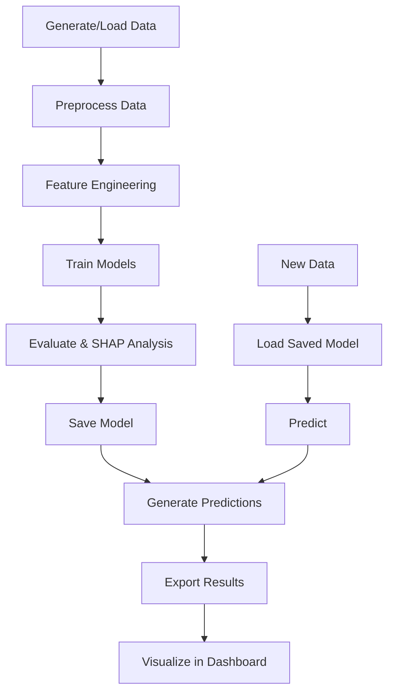

# نموذج تحليل العرض والسوق
# Supply & Market Analysis Model

<div dir="rtl">

## نظرة عامة

نموذج تحليل العرض والسوق هو نظام تعلم آلي متقدم مصمم لتوقع التكاليف وتحليل المخاطر في سلسلة التوريد. يستخدم النموذج **XGBoost** مع تحليل **SHAP** لتوفير توقعات دقيقة وقابلة للتفسير.

</div>

---

## Overview

The Supply & Market Analysis Model is an advanced machine learning system designed to predict costs and analyze risks in the supply chain. The model uses **XGBoost** with **SHAP** analysis to provide accurate and interpretable predictions.

---

<div dir="rtl">

## المخرجات الرئيسية

1. **التكلفة المتوقعة عند الوصول** (Predicted Landed Cost) - بالدولار لكل طن
2. **مستوى إنذار العرض** (Supply Alert Level) - منخفض/متوسط/مرتفع
3. **العامل الأكثر تأثيراً** (Driver Cost Key) - الميزة الأكثر تأثيراً على التكلفة

</div>

## Key Outputs

1. **Predicted Landed Cost** - in USD per ton
2. **Supply Alert Level** - Low/Med/High
3. **Most Influential Cost Driver** - Feature with highest impact

---

## 📁 Project Structure

```
f:/All Projects/Haeel Saeed Model/
├── notebooks/
│   └── supply_market_analysis.ipynb    # Main analysis notebook
├── src/
│   ├── __init__.py                     # Package initialization
│   ├── data_generator.py               # Synthetic data generation
│   ├── preprocessing.py                # Data preprocessing
│   ├── feature_engineering.py          # Feature creation
│   ├── models.py                       # Model training & SHAP
│   └── utils.py                        # Helper functions
├── data/
│   └── synthetic_supply_market.csv     # Generated dataset
├── models/
│   └── xgboost_model.joblib           # Saved trained model
├── output/
│   └── predictions.csv                 # Model predictions
├── app.py                              # Streamlit dashboard
├── requirements.txt                    # Python dependencies
└── README.md                           # This file
```

---

## 🚀 Quick Start

<div dir="rtl">

### 1. التثبيت - Installation

</div>

```bash
# Clone or navigate to the project directory
cd "f:/All Projects/Haeel Saeed Model"

# Install dependencies
pip install -r requirements.txt
```

<div dir="rtl">

### 2. توليد البيانات - Generate Data

</div>

```bash
# Generate synthetic dataset
python src/data_generator.py
```

This will create `data/synthetic_supply_market.csv` with 5000+ rows of realistic supply chain data.

<div dir="rtl">

### 3. تشغيل Jupyter Notebook - Run Jupyter Notebook

</div>

```bash
# Start Jupyter
jupyter notebook

# Open: notebooks/supply_market_analysis.ipynb
# Run all cells (Cell -> Run All)
```

The notebook will:
- Load and explore the data
- Apply preprocessing and feature engineering
- Train baseline and XGBoost models
- Generate SHAP analysis
- Export predictions and save the model

<div dir="rtl">

### 4. تشغيل Dashboard - Run Streamlit Dashboard

</div>

```bash
streamlit run app.py
```

The dashboard will open at `http://localhost:8501` with:
- Overview page with statistics
- Predictions visualization
- Advanced analysis
- New prediction interface

---

## 📊 Data Schema

<div dir="rtl">

### الأعمدة المطلوبة - Required Columns

</div>

| Column Name | Type | Description (EN) | الوصف (AR) |
|-------------|------|------------------|------------|
| `Date` | datetime | Daily date | التاريخ اليومي |
| `ID_Commodity` | categorical | Commodity type (wheat/sugar/oil) | نوع السلعة |
| `Anomaly_Price_Global` | float | Global price with anomalies (USD/ton) | السعر العالمي مع الشذوذات |
| `Index_Cost_Shipping` | float | Shipping cost index | مؤشر تكلفة الشحن |
| `Premium_Insurance_Risk_War` | float | Insurance premium (0-1) | علاوة التأمين/المخاطر |
| `Outlook_Production_Local` | categorical | Local production (low/medium/high) | توقعات الإنتاج المحلي |
| `USD_Spread_Price_Market` | float | USD price spread | فارق سعر الدولار |
| `Index_Stress_Chain_Supply` | float | Supply chain stress (0-100) | مؤشر إجهاد السلسلة |
| `News_Sentiment_Score` | float | News sentiment (-1 to 1) | تحليل مشاعر الأخبار |
| `Customs_Fees_Estimate` | float | Estimated customs fees (USD/ton) | الرسوم الجمركية التقديرية |

<div dir="rtl">

### المخرجات - Outputs

</div>

| Column Name | Type | Description |
|-------------|------|-------------|
| `Predicted_Landed_Cost` | float | Predicted cost in USD/ton |
| `Supply_Alert_Level` | categorical | Risk level: Low/Med/High |

---

## 🔄 Using Your Own Data

<div dir="rtl">

### استبدال البيانات الصناعية ببيانات حقيقية

1. **تحضير البيانات**: تأكد من أن ملف CSV الخاص بك يحتوي على جميع الأعمدة المطلوبة أعلاه
2. **حفظ الملف**: ضع ملفك في `data/your_data.csv`
3. **تحديث الكود**: في Notebook، غيّر:

</div>

```python
# Instead of:
df = generate_data(n_rows=5000)

# Use:
df = pd.read_csv('data/your_data.csv')
```

<div dir="rtl">

4. **التحقق من البيانات**: تأكد من تطابق أسماء الأعمدة والأنواع
5. **إعادة التدريب**: شغّل جميع خلايا ال Notebook لإعادة تدريب النموذج

</div>

### Data Sources Recommendations

For production use, consider integrating:

| Data Type | Recommended Sources |
|-----------|---------------------|
| **Global Prices** | Bloomberg, Reuters, Trading Economics |
| **Shipping Costs** | Baltic Exchange, Clarksons Research |
| **News Sentiment** | NewsAPI, Google News API, Twitter API |
| **Customs Data** | Local customs authority APIs |
| **Production Data** | FAO, USDA, local agricultural ministries |
| **Economic Indicators** | World Bank, IMF, central banks |

---

## 🎯 Using the Prediction Function

```python
from src.models import predict_landed_cost

# Predict on new data
results = predict_landed_cost(
    new_data_path='data/new_data.csv',
    model_path='models/xgboost_model.joblib',
    output_path='output/new_predictions.csv'
)

print(results.head())
```

---

## 📈 Model Performance

<div dir="rtl">

### مؤشرات الأداء المتوقعة

</div>

Based on synthetic data:

| Metric | Baseline (Linear) | XGBoost |
|--------|------------------|---------|
| **RMSE** | ~80-100 | ~30-50 |
| **MAE** | ~60-80 | ~20-35 |
| **MAPE** | ~8-12% | ~3-6% |
| **R²** | ~0.75-0.85 | ~0.92-0.97 |

> **Note**: Performance on real data may vary significantly.

---

## 🔍 Feature Importance

<div dir="rtl">

### أهم العوامل المؤثرة

</div>

Based on SHAP analysis, the most influential features typically are:

1. **Anomaly_Price_Global** - Global commodity prices
2. **Index_Cost_Shipping** - Shipping costs
3. **Index_Stress_Chain_Supply** - Supply chain stress
4. **Premium_Insurance_Risk_War** - Insurance and risk premiums
5. **Price lag features** - Historical price patterns

---

## 🛠️ Advanced Features

<div dir="rtl">

### هندسة الميزات - Feature Engineering

</div>

The model automatically creates:

- **Lag features**: Price 7 and 30 days ago
- **Rolling averages**: 7-day and 30-day moving averages
- **Price ratios**: Current price to moving average
- **Interaction features**: Cross-feature interactions
- **Seasonal features**: Month, quarter, season encoding

<div dir="rtl">

### تحليل SHAP - SHAP Analysis

</div>

SHAP (SHapley Additive exPlanations) provides:
- Global feature importance
- Individual prediction explanations
- Driver cost key for each prediction

---

## 📦 Dependencies

Key libraries used:

- **pandas** >= 1.5.0 - Data manipulation
- **numpy** >= 1.23.0 - Numerical operations
- **scikit-learn** >= 1.2.0 - ML preprocessing and baseline
- **xgboost** >= 1.7.0 - Advanced ML model
- **shap** >= 0.41.0 - Model interpretation
- **streamlit** >= 1.20.0 - Interactive dashboard
- **plotly** >= 5.11.0 - Interactive visualizations
- **matplotlib** >= 3.6.0 - Static visualizations

See `requirements.txt` for complete list.

---

## 🔧 Configuration

<div dir="rtl">

### تخصيص النموذج - Customizing the Model

</div>

Edit hyperparameters in `src/models.py`:

```python
xgb_model = XGBoostModel(random_state=42)
xgb_model.train(
    X_train, y_train, 
    tune_hyperparams=True,  # Enable/disable tuning
    n_iter=20               # Number of search iterations
)
```

Modify parameter ranges in `XGBoostModel.train()` method.

---

## 🚨 Alert Thresholds

<div dir="rtl">

### عتبات الإنذار - Alert Level Thresholds

</div>

Alert levels are based on percentage increase from commodity average:

- **Low**: < 10% above average
- **Med**: 10-20% above average
- **High**: > 20% above average

Customize in `src/utils.py` → `classify_alert_level()`:

```python
alert_levels = classify_alert_level(
    predicted_costs, 
    commodity_groups,
    threshold_med=10,   # Change this
    threshold_high=20   # Change this
)
```

---

## 📝 Output Files

<div dir="rtl">

### الملفات الناتجة

</div>

After running the notebook:

1. **`models/xgboost_model.joblib`**
   - Trained XGBoost model
   - Used for predictions on new data

2. **`output/predictions.csv`**
   - Predictions for test set
   - Columns: Date, ID_Commodity, Predicted_Landed_Cost, Supply_Alert_Level, Driver_Cost_Key

3. **`data/synthetic_supply_market.csv`**
   - Generated synthetic dataset
   - Replace with your actual data

---

## 🎨 Dashboard Features

<div dir="rtl">

### ميزات لوحة التحكم

</div>

The Streamlit dashboard (`app.py`) includes:

### 🏠 Home Page
- Quick statistics overview
- Alert distribution pie chart
- Project information

### 📈 Predictions Page
- Interactive time series plots
- Commodity and alert level filters
- Predictions table with download

### 🔍 Analysis Page
- Alert distribution by commodity
- Top cost drivers
- Cost statistics by commodity and alert level

### ⚡ New Prediction Page
- CSV file upload for batch predictions
- Manual input form (under development)

---

## 🔄 Workflow

<div dir="rtl">

### سير العمل الموصى به

</div>



---

## 🧪 Testing

<div dir="rtl">

### اختبار الوحدات

</div>

Test individual modules:

```bash
# Test data generator
python src/data_generator.py

# Test preprocessing
python src/preprocessing.py

# Test feature engineering
python src/feature_engineering.py

# Test utilities
python src/utils.py
```

---

## 🌐 Production Deployment

<div dir="rtl">

### نشر الموديل في بيئة الإنتاج

</div>

### Option 1: API Deployment

Create a FastAPI/Flask API:

```python
from fastapi import FastAPI, File, UploadFile
from src.models import predict_landed_cost
import pandas as pd

app = FastAPI()

@app.post("/predict")
async def predict(file: UploadFile = File(...)):
    df = pd.read_csv(file.file)
    results = predict_landed_cost(df)
    return results.to_dict(orient='records')
```

### Option 2: Scheduled Batch Processing

Use cron/Task Scheduler:

```bash
# Run daily at 6 AM
0 6 * * * cd /path/to/project && python run_daily_predictions.py
```

### Option 3: Cloud Deployment

Deploy dashboard on:
- **Streamlit Cloud** (Free tier available)
- **Heroku**
- **AWS EC2/Lambda**
- **Google Cloud Run**
- **Azure App Service**

---

## 📚 Additional Resources

<div dir="rtl">

### مراجع إضافية

</div>

- **XGBoost Documentation**: https://xgboost.readthedocs.io/
- **SHAP Documentation**: https://shap.readthedocs.io/
- **Streamlit Documentation**: https://docs.streamlit.io/
- **Plotly Documentation**: https://plotly.com/python/

---

## ⚠️ Important Notes

<div dir="rtl">

### ملاحظات هامة

1. **البيانات الصناعية**: البيانات المُولدة هي بيانات صناعية لأغراض التوضيح فقط
2. **الأداء الفعلي**: أداء النموذج على بيانات حقيقية قد يختلف
3. **التحديث الدوري**: يُنصح بإعادة تدريب النموذج كل 3-6 أشهر
4. **التحقق اليدوي**: تحقق من التوقعات عالية المخاطر يدوياً قبل اتخاذ القرارات
5. **الأمان**: لا تشارك البيانات الحقيقية علناً

</div>

---

## 🤝 Contributing

<div dir="rtl">

### المساهمة في المشروع

</div>

To improve this model:

1. Add more data sources
2. Implement additional models (LSTM, Prophet)
3. Enhance the dashboard
4. Add automated testing
5. Improve documentation

---

## 📧 Support

<div dir="rtl">

### الدعم

للأسئلة أو المشاكل:
1. راجع التوثيق في Notebook
2. تحقق من ملفات الكود المصدري في `src/`
3. تأكد من تطابق مخطط البيانات

</div>

For questions or issues:
1. Review the documentation in the notebook
2. Check source code files in `src/`
3. Verify data schema compatibility

---

## 📄 License

<div dir="rtl">

هذا المشروع مفتوح المصدر ومتاح للاستخدام والتعديل.

</div>

This project is open source and available for use and modification.

---

<div dir="rtl">

## 🎯 Next Steps

### الخطوات التالية الموصى بها:

1. **جمع بيانات حقيقية** من الجمارك والموانئ
2. **ربط APIs** للبيانات الحية (أسعار، أخبار، طقس)
3. **تطوير API** للتنبؤ في الوقت الفعلي
4. **إعداد تنبيهات آلية** عبر البريد الإلكتروني أو SMS
5. **دمج مع أنظمة ERP/SCM** الموجودة
6. **إضافة تحليل NLP** للأخبار الاقتصادية
7. **بناء نماذج توقع متعددة الخطوات** للأسابيع القادمة

</div>

### Recommended Next Steps:

1. **Collect real data** from customs and ports
2. **Integrate APIs** for live data (prices, news, weather)
3. **Develop prediction API** for real-time forecasting
4. **Setup automated alerts** via email or SMS
5. **Integrate with existing ERP/SCM** systems
6. **Add NLP analysis** for economic news
7. **Build multi-step forecasting** models for upcoming weeks

---

<div align="center">

**نموذج تحليل العرض والسوق**  
**Supply & Market Analysis Model**

Built with ❤️ using Python, XGBoost, and SHAP

</div>
